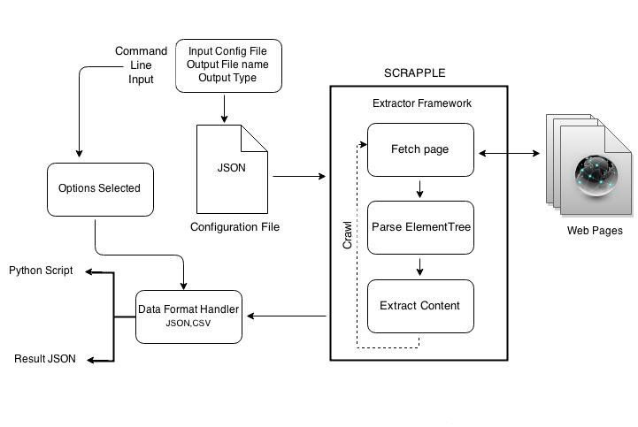

.. _framework-basic:

=====================
Scrapple architecture
=====================

Scrapple provides a command line interface (CLI) to access a set of commands which can be used for implementing various types of web content extractors. The basic architecture of Scrapple explains how the various components are related.

	Scrapple architecture

- :ref:`Command line input <framework-commands>`
	The command line input is the basis of definition of the implementation of the extractor. It specifies the project configuration and the options related to implementing the extractor.

- :ref:`Configuration file <framework-config>`
	The configuration file specifies the rules of the required extractor. It contains the selector expressions for the data to be extracted and the specification of the link crawler.

- :ref:`Extractor framework <concepts-selectors>`
	The extractor framework handles the implementation of the parsing & extraction. The extractor framework follows the following steps :

	* It makes HTTP requests to fetch the web page to be parsed.
	* It parses through the :ref:`element tree <concepts-structure>`.
	* It extracts the required content, depending on the extractor rules in the configuration file. 
	* In case of crawlers, this process is repeated for all the pages that the extractor crawls through.

- :ref:`Data format handler <concepts-formats>`
	According to the options specified in the CLI input, the extracted content is stored as a CSV document or a JSON document.
