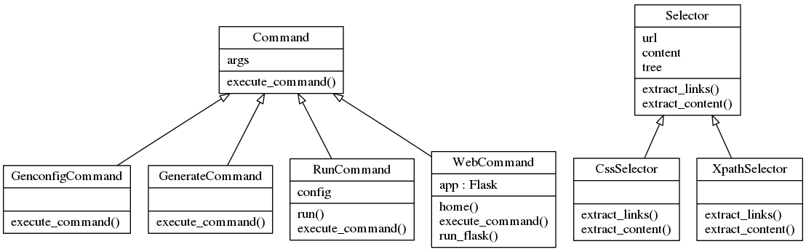

.. _implementation-classes:

Scrapple implementation classes
===============================

There are two main categories of classes involved in the implementation of extractors on Scrapple :

* :ref:`Command classes <implementation-commands>`
* :ref:`Selector classes <implementation-selectors>`

**Command classes** define the execution of the commands provided by Scrapple. 

**Selector classes** define the implementation of the extraction through the selector expressions.

The following class diagram can be used to represent the relationship between the various classes.

	Scrapple class diagram
	