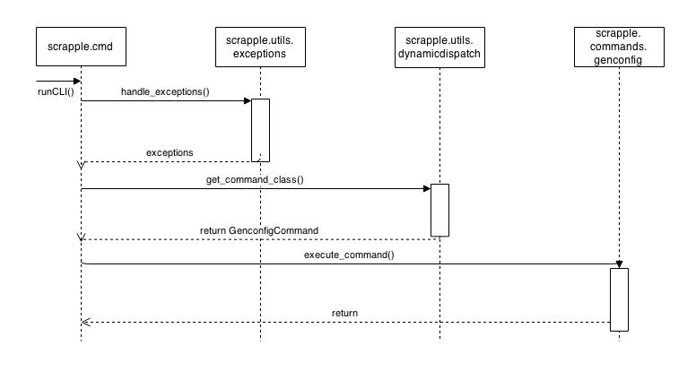
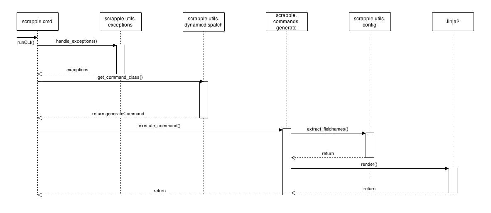
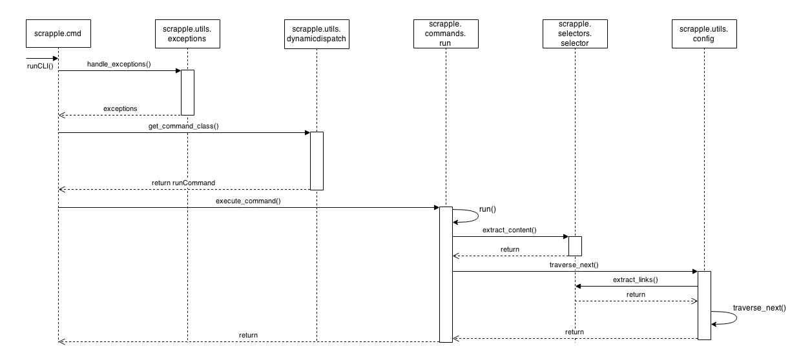
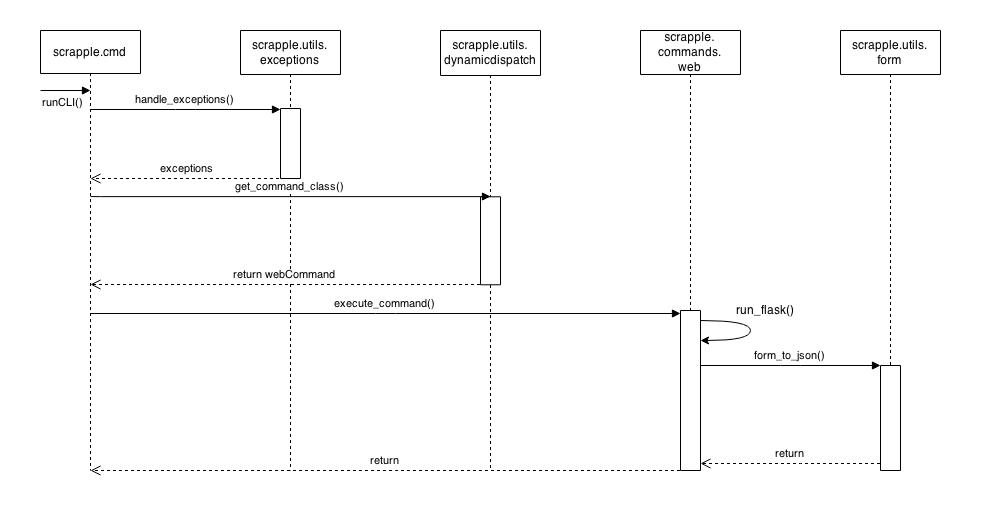

.. _implementation-interaction:

Interaction scenarios
=====================

The primary use cases in Scrapple are the execution of the :ref:`commands <framework-commands>` provided by the framework. A general idea of the execution of these commands and the relation between the various modules of the framework can be understood through a study of the interaction scenarios for each of the commands. 

Basic sequence diagrams for the execution for each command can be represented as such. A more detailed explanation of the execution of the commands is provided in the :ref:`commands implementation <implementation-commands>` section.

	:ref:`Genconfig command<command-genconfig>`

	:ref:`Generate command<command-generate>`

	:ref:`Run command<command-run>`

	:ref:`Web command<command-web>`
