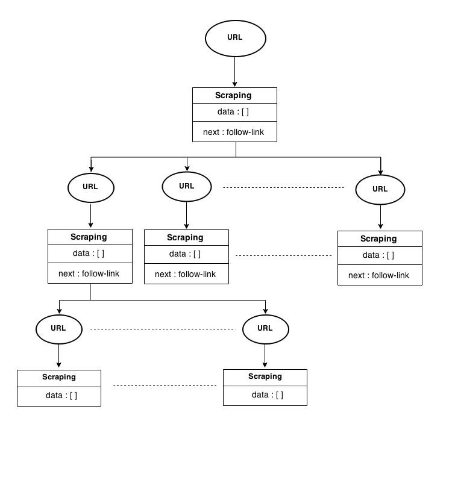

.. _implementation-utils:

Utility functions
=================

.. automodule:: scrapple.utils.dynamicdispatch

.. autofunction:: scrapple.utils.dynamicdispatch.get_command_class

This function is implemented through this simple code block :

.. code-block:: python

		from scrapple.commands import genconfig, generate, run, web
		cmdClass = getattr(eval(command), command.title() + 'Command')
		return cmdClass

.. automodule:: scrapple.utils.exceptions

.. autofunction:: scrapple.utils.exceptions.handle_exceptions

The function uses regular expressions to validate the CLI input. 

.. code-block:: python

	projectname_re = re.compile(r'[^a-zA-Z0-9_]')
	if args['genconfig']:
		if args['--type'] not in ['scraper', 'crawler']:
			raise Exception("--type has to be 'scraper' or 'crawler'")
		if args['--selector'] not in ['xpath', 'css']:
			raise Exception("--selector has to be 'xpath' or 'css'")
	if args['generate'] or args['run']:
		if args['--output_type'] not in ['json', 'csv']:
			raise Exception("--output_type has to be 'json' or 'csv'")
	if args['genconfig'] or args['generate'] or args['run']:
		if projectname_re.search(args['<projectname>']) is not None:
			raise Exception("Invalid <projectname>")
	return

.. automodule:: scrapple.utils.config

.. autofunction:: scrapple.utils.config.traverse_next

In the case of crawlers, the configuration file can be treated as a tree, with the anchor tag links extracted from the follow link selector as the child nodes. This level-wise representation of the crawler configuration file provides a clear picture of how the file should be parsed. 

	Tree representation of crawler

This recursive generator performs a depth-first traversal of the config file tree. It can be implemented through this code snippet :

.. code-block:: python

	for link in page.extract_links(next['follow_link']):
		r = results.copy()
		for attribute in next['scraping'].get('data'):
			if attribute['field'] != "":
				r[attribute['field']] = \
				link.extract_content(attribute['selector'], 
				attribute['attr'], 
				attribute['default'])
		if not next['scraping'].get('next'):
			yield r
		else:
			for next2 in next['scraping'].get('next'):
				for result in traverse_next(link, next2, r):
					yield result

.. autofunction:: scrapple.utils.config.get_fields

get_fields() parses the configuration file through a recursive generator, yielding the field names encountered.

.. code-block:: python

	for data in config['scraping']['data']:
		if data['field'] != '': 
			yield data['field']
	if 'next' in config['scraping']:
		for n in config['scraping']['next']:
			for f in get_fields(n): 
				yield f

.. autofunction:: scrapple.utils.config.extract_fieldnames

The extract_fieldnames() function uses the get_fields() generator, and handles cases like multiple occurrences of the same field name.

.. code-block:: python

	fields = []
	for x in get_fields(config):
		if x in fields:
			fields.append(x + '_' + str(fields.count(x) + 1))
		else:
			fields.append(x)
	return fields

.. automodule:: scrapple.utils.form

.. autofunction:: scrapple.utils.form.form_to_json

The web form is structured in a way that all the data field are linearly numbered. This is done so that it is easier to process the form while converting it into a JSON document.

.. code-block:: python

	for i in itertools.count(start=1):
		try:
			data = {
				'field': form['field_' + str(i)],
				'selector': form['selector_' + str(i)],
				'attr': form['attribute_' + str(i)],
				'default': form['default_' + str(i)]
			}
			config['scraping']['data'].append(data)
		except KeyError:
			break
