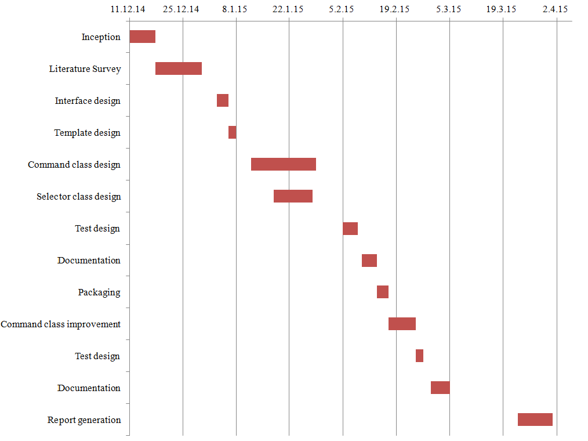
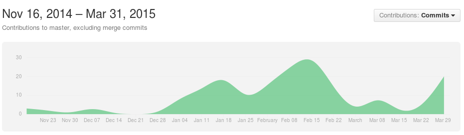
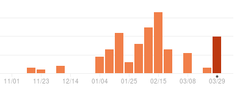

.. _intro-timeline:

================
Project timeline
================

The overall project work can be summarized in this Gantt chart.

	Gantt chart - Project timeline

The project repository was hosted on `GitHub <http://github.com/>`_. This provided multiple benefits :

* Ease of collaboration between project members
* Convenient version control of project
* Setting up continuous integration testing on the project
* Metrics for analysis of project progress

The metrics provided by GitHub can be used to visually represent the contributions to the project over the duration of the project work.

	Commit frequency on `the Scrapple GitHub repository <http://github.com/scrappleapp/scrapple>`_ 

	Weekly contributions to the project repository

